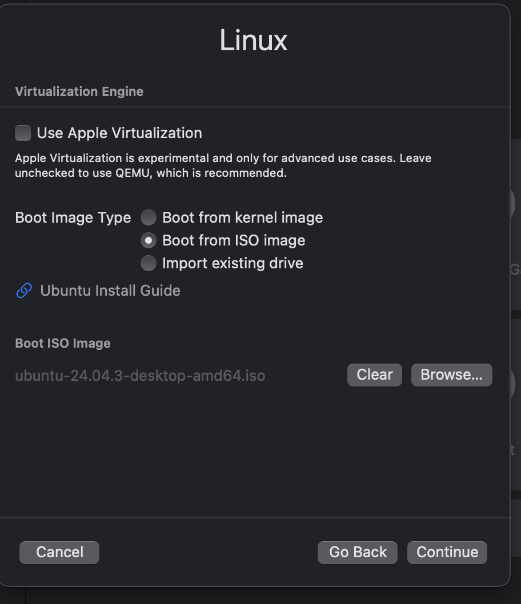
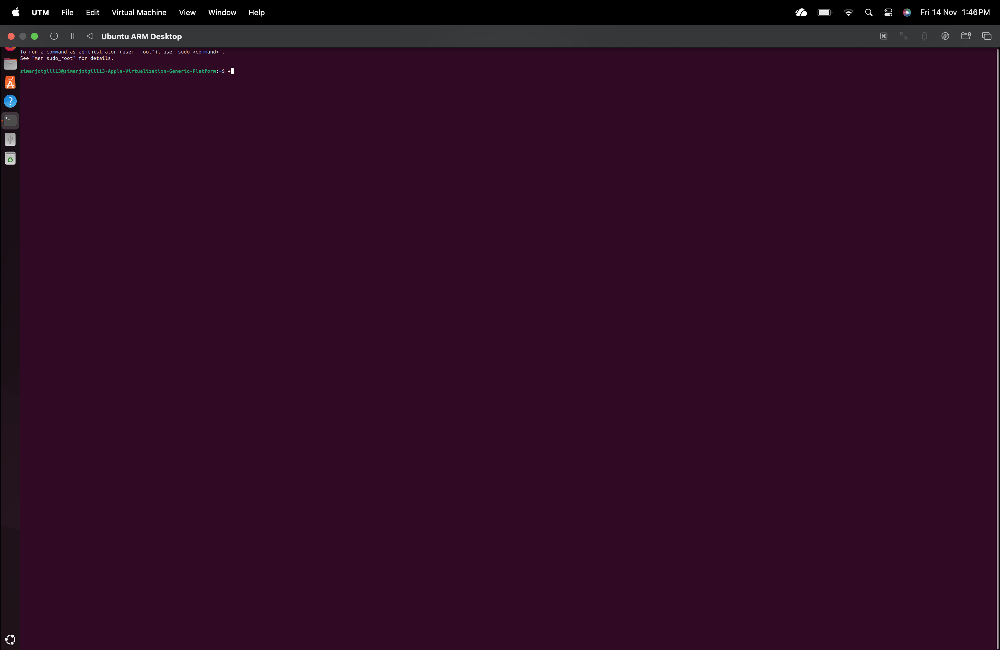

# Experiment 1: Linux OS Environment Setup  

---

## Aim
To install UTM on macOS and set up a Linux operating system (Ubuntu) in a virtual machine, enabling practice of Linux commands and exploration of a Linux environment.

---

## Requirements
- **Host Operating System:** macOS Tahoe  
- **Virtualization Software:** UTM  
- **Guest Operating System:** Ubuntu 24.04.3 LTS (ARM 64-bit)  
- **ISO File:** `ubuntu-24.04.3-desktop-arm64.iso`

---

## Procedure

### Step 1: Download UTM
- Visit **https://mac.getutm.app**  
- Download and install UTM for macOS (Apple Silicon supported).  

---

### Step 2: Download Ubuntu Desktop (ARM)
- Go to **https://cdimage.ubuntu.com/releases/24.04.3/release/**  
- Download **Ubuntu 24.04.3 LTS Desktop – ARM 64-bit** ISO. 

---

### Step 3: Install and Launch UTM
- Drag **UTM.app** to the Applications folder.  
- Open UTM from Launchpad.  
- 

---

### Step 4: Create a New Virtual Machine
- Click **Create New** → choose **Virtualize** → select **Linux**.  

---

### Step 5: Attach Ubuntu ISO
- Select **Boot from ISO Image**.  
- Browse and choose `ubuntu-24.04.3-desktop-arm64.iso`.  
- 

---

### Step 6: Configure Virtual Hardware
Set the following:

- **CPU Cores:** 4  
- **Memory:** 4096 MB (4 GB) or higher  
- **Storage:** 40 GB (QCOW2 format)  


Click **Continue** and **Save** the VM.

---

### Step 7: Install Ubuntu
- Start the VM by clicking the **Play** button.  
- The Ubuntu graphical installer will appear.  
- Follow the installation steps:  
  - Choose language  
  - Select Normal installation  
  - Create username & password  
  - Install updates and third-party software  

- 

---

### Step 8: Update the System
After installation, open Terminal using  and run:

```bash
sudo apt update
sudo apt upgrade
```

- 


---

## Observations:

1. UTM successfully created and ran the Ubuntu virtual machine.

2. Ubuntu Desktop ARM edition installed correctly with full GUI support.

3. Terminal commands executed without any issues.

4. The VM provided a stable environment for practicing Linux.


---

## Conclusion:

A complete Linux environment was set up on macOS using UTM.
Ubuntu 24.04.3 LTS (ARM 64-bit) was installed successfully, providing a smooth and functional virtual Linux environment suitable for learning and experimentation
