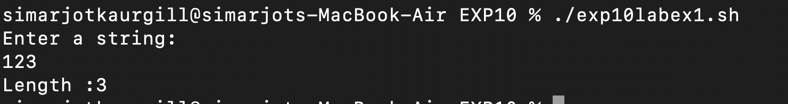
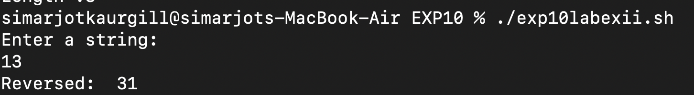
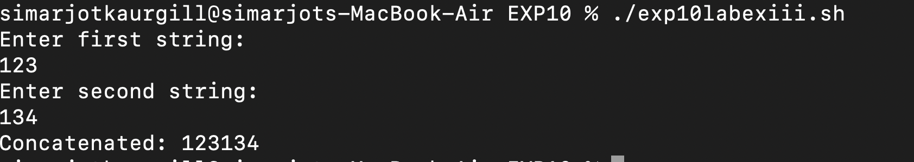
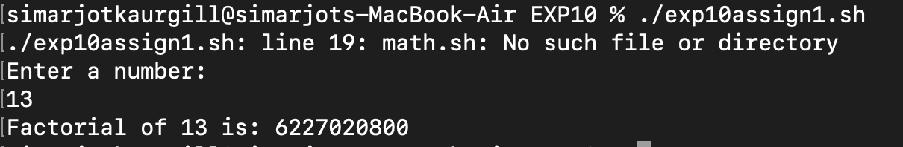
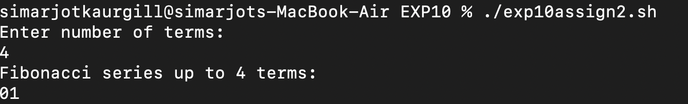

# EXPERIMENT 10 - Shell Programming (Functions, Optimization ands sed command )

## AIM
To understand modular shell programming using functions, script sourcing, optimization techniques, string operations, and to study practical usage of the sed stream editor.

---

## Tools & Software Used
- **Operating System:** macOS
- **Terminal Emulator:** macOS Terminal 
- **Shell:** Bash

---

##Theory

1. Modular & Reusable Code (Functions and Sourcing)
   Modular programming breaks code into reusable componnets called functions. Functions increase readability and reduce repitition.
   
   Sourcing a script using :
   ```bash
   source script.sh
   . script.sh
   ```
   imports functions and variables from another script into the current shell.
   Unlike executing, sourcing does not create a subshell.
   
   2. Script Optimization Techniques 
      Avoid unnecessary subshells : $(command) is expensive.
      Use bash built-in string operations (faster than expr,sed,awk)
    Minimize loops by using built-in expansions.
   
   3. String Operations
   Built-in operations include :
   ```bash
   ${#str}     #length
   ${str:1:3}  #substring
   ${str#he}   #remove prefix
   ${str%lo}   #remove suffix
   ```
   These are faster than external tools like wc or cut.
   
   4. sed - Stream Editor 
   sed is used for automating text modifications. It supports substitution,deletion,printing, insertion,regex etc.
   ```bash
   sed 's/old/new/g' file.txt
   sed '5d' file.txt
   sed -n '1,5p' file.txt
   sed '/pattern/d' file.txt
   
   ```
   ---
   
   # LAB EXERCISES
   
   ### **TASK 1 - String length**
   
   **SCRIPT (labex1.sh)**
   
   ```bash
   #!/bin/bash
   echo "Enter a string:"
   read str
   echo "Length :${#str}"

   ```

**OUTPUT :**


---

### **TASK 2 - Reverse String**

**SCRIPT (labexii.sh)**

```bash
#!/bin/bash
echo "Enter a string:"
read str
rev=" "
len=${#str}
for (( i=$len-1; i>=0; i--))
do
rev="$rev${str:$i:1}"
done
echo "Reversed: $rev"
 ```
 
 **OUTPUT :**
 
 
 ---
 
 ### **TASK 3 - Concatenate Strings**
 
 **SCRIPT (labexiii.sh)**
 ```bash
 #!/bin/bash
echo "Enter a string:"
read str
rev=" "
len=${#str}
for (( i=$len-1; i>=0; i--))
do
rev="$rev${str:$i:1}"
done
echo "Reversed: $rev"

 ```
 
 **OUTPUT :**
 
 
 ---
 
 ## **CONCLUSION**
 
 In this experiment, we learned :
 Modular programming using functions and sourcing.
 Optimized shell scripting with built-ins.
 String operations using bash parameters.
 Text manipulation using sed.
 Practical scripts like factorial,Fibonacci,filename length, concatenation.
 
 ---
 
 # **ASSIGNMENT**
 
 ### **Task 1 - Factorial Function(Modular approach)**
 
 **SCRIPT (assign1.sh)**
 ```bash
 #!/bin/bash

factorial() {
    local n=$1
    local result=1

    if [ $n -eq 0 ] || [ $n -eq 1 ]; then
    echo 1
    return
    fi
    for (( i=2; i<=n; i++ ))
    do
        result=$((result * i))
    done
    echo $result
}
#!/bin/bash

source math.sh
echo "Enter a number: "
read num

result=$(factorial $num)
echo "Factorial of $num is: $result"
```

**OUTPUT :**


---


### **TASK 2 - Optimized Fibonacci Script with Functions**

**SCRIPT (assign2.sh)**
```bash
#!/bin/bash

#Function to calculate Fibonacci series
fibonacci() {
local n=$1
local a=0
local b=1
local temp

echo "Fibonacci series up to $n terms:"

for (( i=0; i<n; i++ ))
do
echo -n "$a"
temop=$((a + b))
a=$b
b=$temp
done
echo
}
#Main script

echo "Enter number of terms:"
read terms

#input validation
if [[ ! $terms =~ ^[0-9]+$ ]] || [ $terms -lt 1 ]; then
echo "Error: Please enter a positive integer"
exit 1
fi

#call the function
fibonacci $terms
```

**OUTPUT :**


---

### **Task 3 - Filename Lengths in Directory**

**SCRIPT (assign3.sh)**
```bash
#!/bin/bash

echo "Enter directory path (press enter for current directory):"
read dirpath

# Use current directory if empty
if [ -z "$dirpath" ]; then
    dirpath="."
fi

# Check if directory exists
if [ ! -d "$dirpath" ]; then
    echo "Error: Directory '$dirpath' does not exist"
    exit 1
fi

echo "Filename lengths in '$dirpath':"
echo "--------------------------------"

# Process each file in the directory
for file in "$dirpath"/*
do
    if [ -e "$file" ]; then  # Check if file exists
        filename=$(basename "$file")
        length=${#filename}
        printf "%-30s : %2d characters\n" "$filename" "$length"
    fi
done
```
**OUTPUT :**


---
 
 
