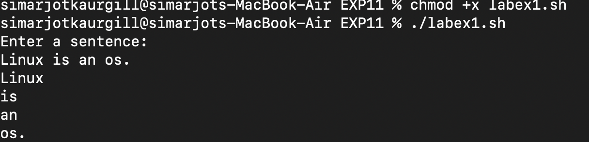
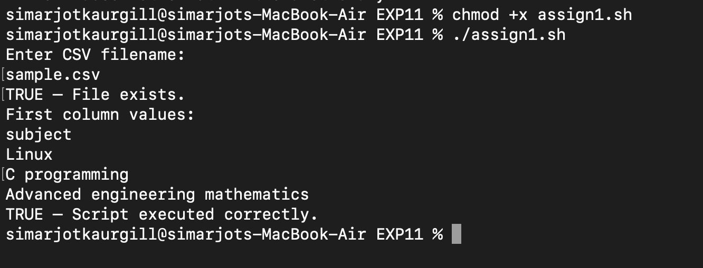
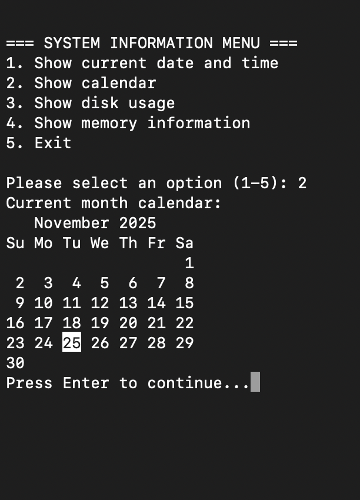
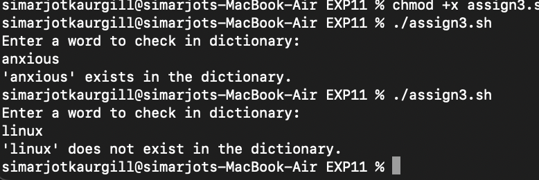

# EXPERIMEMT 11 - Interacting with users and data processing in shell

## AIM :
Top write interactive shell scripts that accept user input, create menus, validate input,parse structured data formats and perform basic text/data operations using tools like cut,awk,sed and database commands.

## Tools & Software used :
- **Operating System:** macOS
- **Terminal Emulator:** macOS Terminal
- **Shell:** Bash

---


##LAB EXERCISES
 
### **TASK 1 - Split Sentence into words**

**Script (labex1.sh)
```bash
#!/bin/bash
echo "Enter a sentence:"
read sentence
for word in $sentence; do
    echo "$word"
done
```

** OUTPUT :**


---

### **TASK 2 - Palindome Check**

**Script (labex2.sh)
```bash
#!/bin/bash
echo "Enter string:"
read str
rev=$(echo "$str" | rev)

if [ "$str" = "$rev" ]; then
    echo "Palindrome"
else
    echo "Not palindrome"
fi
```

**OUTPUT :**


---

## **CONCLUSION :**
In this experiment, we practiced interactive shell scripts and data-processing tasks using commands like read,cut,sed and also in understanding user input handling and basic automation in Linux.

---

# ASSIGNMENT

## **TASK 1 : CSV File Processing - Print First Column**

**Script (assign1.sh)
```bash
#!/bin/bash

echo "Enter CSV filename:"
read file

if [ -f "$file" ]; then
  echo "TRUE — File exists."
fi

echo "First column values:"
cut -d',' -f1 "$file"

if [ $? -eq 0 ]; then
  echo "TRUE — Script executed correctly."
fi

```

**OUTPUT :**


---

## **TASK 2 : Interactive Menu System**

**Script (assign2.sh)**
```bash
#!/bin/bash

# Function definitions
show_date() {
    echo "Current date and time: $(date)"
}

show_calendar() {
    echo "Current month calendar:"
    cal
}

show_disk_usage() {
    echo "Disk usage:"
    df -h
}

show_memory_info() {
    echo "Memory information:"
    free -h
}

# Main menu
while true; do
    echo ""
    echo "=== SYSTEM INFORMATION MENU ==="
    echo "1. Show current date and time"
    echo "2. Show calendar"
    echo "3. Show disk usage"
    echo "4. Show memory information"
    echo "5. Exit"
    echo ""
    
    read -p "Please select an option (1-5): " choice
    
    case $choice in
        1)
            show_date
            ;;
        2)
            show_calendar
            ;;
        3)
            show_disk_usage
            ;;
        4)
            show_memory_info
            ;;
        5)
            echo "Goodbye!"
            break
            ;;
        *)
            echo "Invalid option! Please enter a number between 1-5."
            ;;
    esac
    
    read -p "Press Enter to continue..."
    clear
done
```

**OUTPUT :**


---

## **TASK 3 : Dictionary Word Check**

**SCRIPT (assign3.sh)**
```bash
#!/bin/bash

DICTIONARY="/usr/share/dict/words"

# Check if dictionary file exists
if [ ! -f "$DICTIONARY" ]; then
    echo "Error: Dictionary file not found at $DICTIONARY"
    echo "Try installing with: sudo apt install wamerican"  # For Ubuntu/Debian
    exit 1
fi

echo "Enter a word to check in dictionary:"
read word

# Convert to lowercase for case-insensitive search
word_lower=$(echo "$word" | tr '[:upper:]' '[:lower:]')

# Method 1: Using grep (exact match)
if grep -q "^${word_lower}$" "$DICTIONARY"; then
    echo "'$word' exists in the dictionary."
else
    echo "'$word' does not exist in the dictionary."
fi

# Alternative Method 2: Using awk
# if awk -v word="$word_lower" 'tolower($0) == word {found=1; exit} END{exit !found}' "$DICTIONARY"; then
#     echo "'$word' exists in the dictionary."
# else
#     echo "'$word' does not exist in the dictionary."
# fi

```

**OUTPUT :**


---


