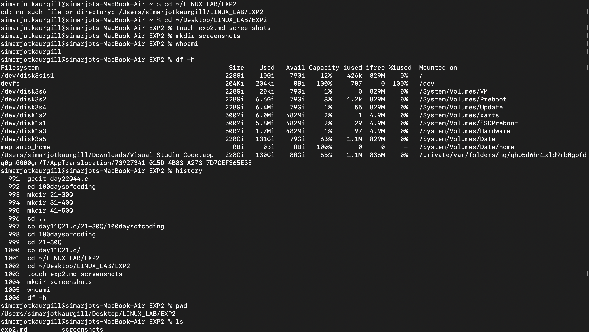

# Experiment 2 — Linux File System Permissions and Essential Commands

**AIM:**  
To understand Linux file systems, directory structures, and file permissions through basic commands and hands-on practice.

---
## TOOLS USED :
- **Terminal:** macOS  
- **Shell:** Bash  

---


## LAB TASKS :

###1. Created a directory structure:
   ```bash
   mkdir -p test_project
```
###2. Created and managed files using :
   ```bash 
   touch, cp, mv, rm
   ````
###3. Modified permissions using :
```bash
chmod 755 filename 
```
###4. Changed file ownership :
```bash
sudo chown user : group filename 
```
###5. Viewed file using :
```bash 
cat, head, tail,less
```
###6. Edited files using :
```bash
nano filename
```
###7. Checked user and system info with :
```bash
whoami, uname -a, df -h, history
```
###8. Navigated directories using :
```bash
pwd, ls,cd, cd ..
```
###9. Removed directories :
```bash
rmdir , rm -r
```
---

## **OUTPUT :**


---

##Conclusion
Successfully practiced Linux file operations, permissions, and system commands to understand the file system hierarchy and access control.

---
