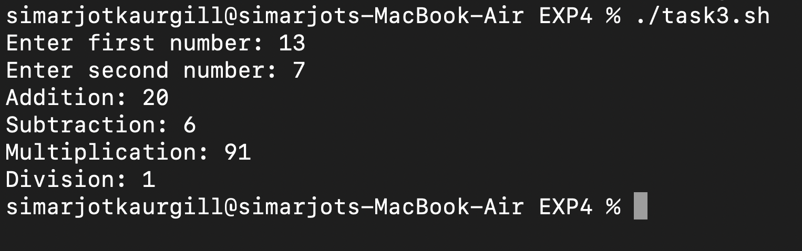

# EXPERIMENT 4 – SHELL PROGRAMMING

## AIM : 
To understand the fundamentals of Bash Shell Scripting by writing simple programs for printing messages, handling user input, performing arithmetic operations, and applying conditional logic.

---

## TOOLS USED : 
- **Terminal:** macOS  
- **Shell:** Bash  

---

## LAB TASKS 

### **TASK 1 – Hello World Script**


**SCRIPT (task1.sh):**
```bash
#!/bin/bash
echo "Hello, World!"

./task1.sh
```

**OUTPUT :**


---

### **TASK 2 - Personalized Greeting**


**SCRIPT (task2.sh):**
```bash
#!/bin/bash
echo "Enter your name: "
read name
echo "Hello, $name! Welcome to Shell Scripting."

./task2.sh
```

**OUTPUT :**


---

### **TASK 3 - Arithmetic Operations**


**SCRIPT (task3.sh):**
```bash
#!/bin/bash
echo "Enter first number : "
read num1
echo "Enter second number : "
read num2

echo "Addition: $((num1 + num2))"
echo "Subtraction: $((num1 - num2))"
echo "Multiplication: $((num1 * num2))"
echo "Division: $((num1 / num2))"

./task3.sh
```

**OUTPUT :**


---

### TASK 4 - Voting Eligibility


**SCRIPT (task4.sh)**
```bash
#!/bin/bash
echo "Enter your age : "
read age

if [ $age -ge 18 ];
then
    echo "You are eligible to vote."
else
    echo "You are not eligible to vote."
fi

./task4.sh
```

**OUTPUT :**


---

### **Observations**

Task 1: Printed a simple message.

Task 2: Displayed personalized greeting based on user input.

Task 3: Performed arithmetic operations correctly.

Task 4: Checked voting eligibility using conditional logic.Conclusion

This experiment provided practical knowledge of writing and executing Bash shell
 scripts. It covered the basics of displaying messages, accepting user input,
  performing calculations, and implementing decision-making using conditions.
   These skills form the foundation for advanced shell scripting.
---
### **Conclusion**

This experiment provided practical knowledge of writing and executing Bash shell
 scripts. It covered the basics of displaying messages, accepting user input,
  performing calculations, and implementing decision-making using conditions. 
 These skills form the foundation for advanced shell scripting.


