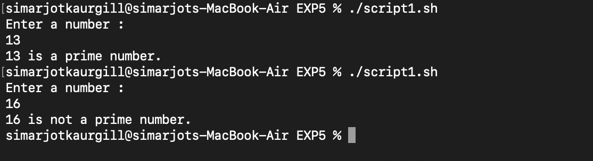

# EXPERIMENT 5 – SHELL PROGRAMMING(Conditional statements & loops)

## AIM :
To understand and implement **conditional statements, loops, and decision-making** in Bash by 
solving mathematical problems using shell scripts.

---

## TOOLS AND SOFTWARE USED : 
- **Operating System:** macOS  
- **Terminal Emulator:** macOS Terminal  
- **Shell:** Bash  

---


## LAB TASKS


## **TASK 1 – Prime Number Check**


**Script (script1.sh):**
```bash
#1/bin/bash

echo "Enter a number : "
read num
flag=0

for ((i=2; i<=num/2; i++))
do
  if [ $((num % i)) -eq 0 ]
  then
      flag=1
      break
 fi
done 

if [ $flag -eq 0 ]
  then
     echo "$num is a prime number."
  else
     echo "$num is not a prime number."
  fi


./prime.sh
```

**OUTPUT :**


---


### **Task 2 - Sum of digits**


**SCRIPT (script2.sh):**
```bash
#!/bin/bash
echo "Enter a number: "
read num
sum=0

while [ $num -gt 0 ]
do
   digit=$((num % 10))
   sum=$((sum + digit))
   num=$((num / 10))
done

echo "Sum of digits: $sum"

./task2.sh
```

**OUTPUT :**


---

### **TASK 3 - Armstrong Number Check**


**SCRIPT (script3.sh):**
```bash
#!/bin/bash
echo "Enter a number: "
read num
temp=$num
n=${#num} # number of digits
sum=0

while [ $temp -gt 0 ]
do
    digit=$((temp % 10))
    sum=$((sum + digit**n))
    temp=$((temp / 10))
done

if [ $sum -eq $num ]
then
    echo "$num is an Armstrong number."
else
    echo "$num is not an Armstrong number."
fi

./task3.sh
```

**OUTPUT :**


---


### **Observations**

The prime number script correctly identified prime numbers.

The sum of digits script calculated digit sums accurately.

The Armstrong script successfully verified Armstrong numbers.

Conditional statements (if, else) controlled flow correctly.

Loops (for, while) efficiently handled repetitive tasks.


---

### **Conclusion**

This experiment improved understanding of decision-making and loops in Bash scripting.
The tasks demonstrated how mathematical problems can be solved using conditions, loops, and
 logical flow in shell scripts on macOS Terminal.


# **experimental tasks**

## **TASK 1 – Hello World Script**

###Write a script that prints Hello,World!

**SCRIPT (task1.sh):**
```bash
#!/bin/bash
echo "Hello, World!"

./task1.sh
```

**OUTPUT :**


---

## **TASK 2 - Personalized Greeting**

###Ask the user's name and greet them.

**SCRIPT (task2.sh):**
```bash
#!/bin/bash
echo "Enter your name: "
read name
echo "Hello, $name! Welcome to Shell Scripting."

./task2.sh
```

**OUTPUT :**


---

## **TASK 3 - Arithmetic Operations**

###Take two numbers as input and print sum, difference, product and quotient.

**SCRIPT (task3.sh):**
```bash
#!/bin/bash
echo "Enter first number : "
read num1
echo "Enter second number : "
read num2

echo "Addition: $((num1 + num2))"
echo "Subtraction: $((num1 - num2))"
echo "Multiplication: $((num1 * num2))"
echo "Division: $((num1 / num2))"

./task3.sh
```

**OUTPUT :**


---

## **TASK 4 - Voting Eligibility**

###Write a script to take input from the user and check whether he/she is eligible to vote.

**SCRIPT (task4.sh):**
```bash
#!/bin/bash
echo "Enter your age : "
read age

if [ $age -ge 18 ]
then
   echo "You are eligible to vote."
else
   echo "You are not eligible to vote."
fi

./task4.sh
```

**OUTPUT :**


---

## **TASK 5 - Decision Making**

###Write a script to check whether the number is a prime number or not.

**SCRIPT (task5.sh):**
```bash
#!/bin/bash
echo "Enter a number : "
read num
flag=0

for((i=2; i<=num/2; i++))
do
   if [ $((num % i)) -eq 0 ]
then 
    flag=1
    break
 fi
done

if [ $flag -eq 0 ]
then 
   echo "$num is a prime number."
else
   echo "$num is not a prime number."
fi

./task5.sh
```

**OUTPUT :**


---

### **TASK 6 - Sum of Digits**

###Input a number and write a script to calculate sum of digits.

**SCRIPT (task6.sh):**
```bash
#!/bin/bash
echo "Enter a number: "
read num
sum=0

while [ $num -gt 0 ]
do
   digit=$((num % 10))
   sum=$((sum + digit))
   num=$((num / 10))
done

echo "Sum of digits: $sum"

./task6.sh
```

**OUTPUT :**


---

##**TASK 7 - Armstrong Number Check**

### Write a script to check whether the number is armstrong number or not.

**SCRIPT (task7.sh):**
```bash
#!/bin/bash
echo "Enter a number: "
read num
temp=$num
n=${#num}
sum=0

while [ $temp -gt 0 ]
do
    digit=$((temp % 10))
    sum=$((sum + digit**n))
    temp=$((temp / 10))
done

if [ $sum -eq $num ]
then
    echo "$num is an Armstrong number."
else
    echo "$num is not an Armstrong number."
fi


./task7.sh
```

**OUTPUT :**


---
