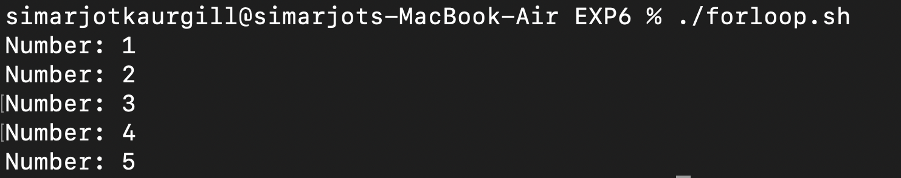
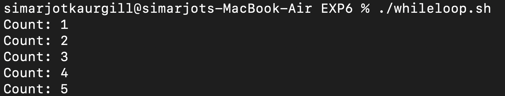
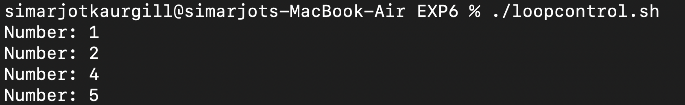
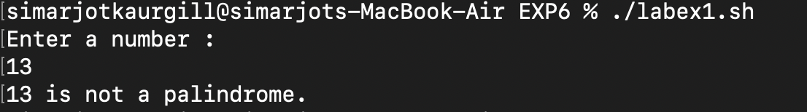
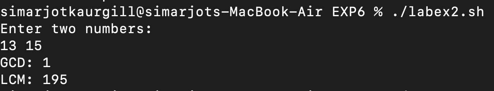
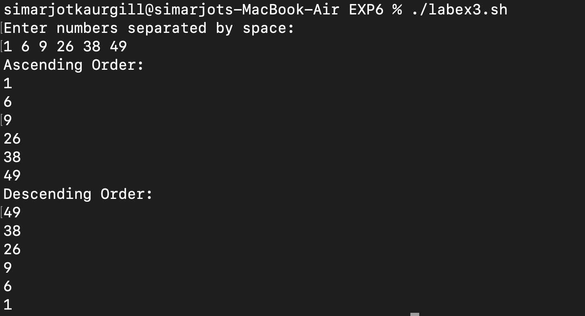
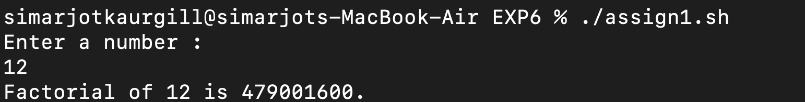
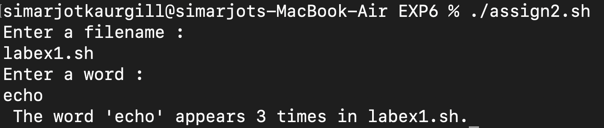
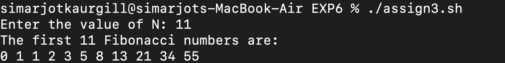
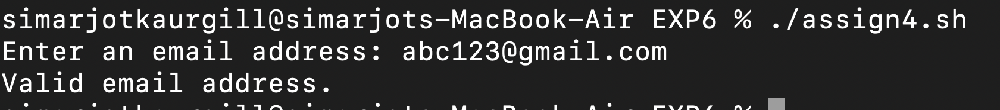

# EXPERIMENT 6 - SHELL PROGRAMMING 

## AIM : 
To learn and practice loops, loop control,shell functions, and debugging in Bash.  

## Tools & Software Used :
- **Operating System:** macOS  
- **Terminal Emulator:** macOS Terminal  
- **Shell:** Bash  

---

# LOOPS 

## SHELL LOOPS

### **1. For loop**
  
**Script (forloop.sh):**  
```bash
#!/bin/bash

for i in 1 2 3 4 5
do 
  echo "Number: $i"
done
./forloop.sh
```

**OUTPUT :**


---

### **2. While loop**

**SCRIPT (whileloop.sh):**
```bash
#!/bin/bash

i=1
while [ $i -le 5 ]
do 
  echo "Count: $i"
  i=$((i+1))
done
./whileloop.sh
```

**OUTPUT :**


---

### **3. Until loop**

**SCRIPT (untilloop.sh):**
```bash
#!/bin/bash

i=1
while [ $i -gt 5 ]
do 
  echo "Count: $i"
  i=$((i+1))
done
./untiloop.sh
```

**OUTPUT :**


---

## **LOOP CONTROL:**

**SCRIPT (loopcontrol.sh):**
```bash
#!/bin/bash

for i in {1..5}
do
  if [ $i -eq 3 ]; then
   continue
fi
  echo "Number: $i"
done
./loopcontrol.sh
```

**OUTPUT :**


---

### **SHELL FUNCTIONS:**

**SCRIPT (shellfunctions.sh):**
```bash
#!/bin/bash

greet() {
  echo "Hello $1"
  }
  greet "User"
./shellfunctions.sh
```

**OUTPUT : **


---

##LAB EXERCISES 

### **TASK 1 - PALINDROME CHECK**

**Script (labex1.sh):**
```bash
#!/bin/bash
echo "Enter a number : "
read num
rev=0
temp=$num


while [ $temp -gt 0 ]
do
  digit=$((temp % 10))
  rev=$((rev * 10 + digit))
  temp=$((temp / 10))
done

if [ $num -eq $rev ]
then 
echo "$num is a palindrome."
else
echo "$num is not a palindrome."
fi
./labex1.sh
```

** OUTPUT :**


---


### **TASK 2 - GCD AND LCM**

**Script (labex2.sh):**
```bash
#!/bin/bash
echo "Enter two numbers: "
read a b

x=$a
y=$b
while [ $y -ne 0 ]
do
   temp=$y
   y=$((x % y))
   x=$temp
done
gcd=$x

lcm=$(( (a * b ) / gcd ))

echo "GCD: $gcd"
echo "LCM: $lcm"
./exp6labex2.sh
```

** OUTPUT:**


---

### **TASK 3 - SORTING NUMBERS**

**Script (labex2.sh):**
```bash
#!/bin/bash
echo "Enter numbers separated by space: "
read -a arr

echo "Ascending Order: "
printf "%s\n" "${arr[@]}" | sort -n

echo "Descending Order: "
printf "%s\n" "${arr[@]}" | sort -nr
 
./exp6labex3.sh
```

** OUTPUT: **



---


## **Observations**


Loops worked correctly (for, while, until).

Continue and break controlled loop execution properly.

Functions allowed reusable blocks of code.
 
---

## **Conclusion**

This experiment improved understanding of loops, functions, conditions, and
debugging in shell scripting.

---

# ASSIGNMENTS

## **TASK 1 : Calculate the Factorial**

Write a function to calculate the factorial of a number using a loop.


**SCRIPT (assign1.sh):**
```bash
#!/bin/bash
echo "Enter a number : "
read num

fact=1
i=1

while [ $i -le $num ]
do
  fact=$((fact * i ))
  i=$((i + 1))
done

echo "Factorial of $num is $fact."

./assign1.sh
```

**OUTPUT :**


---


## **TASK 2 : **

Write a script that reads a filename and counts how many times a given word appears in it.


**SCRIPT : (assign2.sh)**
```bash
#1/bin/bash
echo "Enter a filename : "
read file

echo "Enter a word : "
read word

count=0

for w in $(cat "$file")
do
if [ "$w" = "$word" ]
then
  count=$((count + 1))
 fi
done 

echo " The word '$word' appears $count times in $file."

./assign2.sh
```

**OUTPUT :**



---


### **TASK 3 **

Write a script that generates the first N Fibonacci numbers using a while loop.


**SCRIPT : (assign3.sh)**
```bash
#!/bin/bash
echo -n "Enter the value of N: "
read N

a=0
b=1
count=0

echo "The first $N Fibonacci numbers are: "

while [ $count -lt $N ]
do
   echo -n "$a "

   fn=$((a + b))
   a=$b
   b=$fn

   count=$((count + 1))
done
echo

./assign3.sh
```

**OUTPUT :**



---


### **TASK 4 **

Write a script that validates whether the entered string is a proper email address using a regular expression.


**SCRIPT : (assign4.sh)**
```bash
#!/bin/bash
echo -n "Enter an email address: "
read email

if [[ $email =~ ^[a-zA-Z0-9._%+-]+@[a-zA-Z0-9.-]+\.[a-zA-Z]{2,}$ ]]
then
  echo "Valid email address."
else 
  echo "invalid email address."
fi
./assign4.sh
```

**OUTPUT :**


---


### **TASK % :**

Write a script with an intentional error,run it with bash -x ,and explain the debug output.

**SCRIPT : (assign5.sh)**
```bash
#!/bin/bash

echo "The number is : $num"
read num

ech "Double of number is : $((num * 2))"

./assign5.sh
```

**OUTPUT : **
[task5 output](./screenshots/exp6assign5.png)

---

