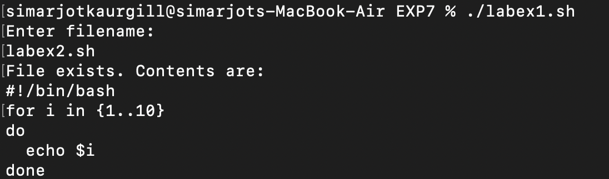

# EXPERIMENT 7 - Shell Programming (Process management and scheduling) 

## AIM 
To understand and use process management commands in Linux, including viewing 
processes, terminating them, changing priority, and scheduling tasks.  

---

## TOOLS AND SOFTWARE USED:
  
- **Operating System:** macOS  
- **Terminal Emulator:** macOS Terminal  
- **Shell:** Bash  

---

## Basic Process Commands  

1. **ps** – Shows currently running processes  


2. **top** – Displays running processes dynamically with CPU and memory usage    

3. **pstree** – Shows process hierarchy (parent–child relation)  
  

4. **kill <PID>** – Terminates a process by its Process ID  
 

---

## Process Prioritization  

1. **nice -n <value> command** – Starts a process with a specific priority  
  

2. **renice <value> -p <PID>** – Changes priority of an already running process  
  

---

## Process Scheduling  

1. **at <TIME>** – Schedules one-time tasks (minutes, hours, days)  
 

2. **cron** – Runs tasks repeatedly at specific times/dates  


---

## Lab Exercises  

### Task 1: File Existence Check  

**Script (labex1.sh) :**  
```bash
#!/bin/bash

echo "Enter filename: "
read file

if [ -e "$file" ]
then
   echo "File exists. Contents are: "
   cat "$file"
else
   echo "File does not exist."
   echo "Do you want to create it? (y/n)"
   read choice
  if ["$choice" = "y" ];
then
   touch "$file"
   echo "File $file created."
   fi
fi
./labex1.sh
```


**Output:**



---


### Task 2: Print Numbers 1 to 10  

**Script (labex2.sh):** 
```bash 
#!/bin/bash
for i in {1..10}
do
  echo $i
done
./labex2.sh
```


**Output:**


---  

### Task 3: Count Lines, Words, and Characters in a File  

**Script (labex3.sh):**
```bash
#!/bin/bash
if [ $# -eq 0 ]
then 
    echo "Usage: $0 filename "
    exit 1
fi

file=$1

if [ -e "$file" ]
then
   echo "Lines: $(wc -l < "$file")"
   echo "Words: $(wc -w < "$file")"
   echo "Characters: $(wc -m < "$file")"
else
   echo "file not found."
fi
./labex3.sh
```

   
**Output:**   


---


### Task 4: Factorial of a Number using Function  


**Script (labex4.sh) :**
  ```bash
factorial() {
  num=$1
  fact=1
 while [ $num -gt 1 ]
 do
   fact=$((fact * num))
   num=$((num - 1))
 done
 echo $fact
}
echo "factorial of 5 is : $(factorial 5)"
echo "factorial of 7 is : $(factorial 7)"
echo "factorial of 10 is: $(factorial 10)"
./labex4.sh
```


**Output:** 


---

## Observations  
- Commands **ps, top, pstree** helped view running processes.  
- Used **kill** to terminate and **nice/renice** to manage process priorities.  
- Scheduled one-time tasks with **at** and recurring jobs with **cron**.  

---

## Conclusion  
This experiment improved understanding of process management and scheduling in Linux.  
It showed how to monitor, control, and automate processes effectively.  

---


#ASSIGNMENT

### **Task 1**

Write a script that monitors the top 5 processes consuming the most CPU and logs 
them into afile evry 10 seconds.

**SCRIPT (assign1.sh) :**
```bash
#!/bin/bash

logfile="cpu_usage.log"

echo "Monitoring top 5 CPU-consuming processes..."
echo "Logging output to $logfile"
echo "Press Ctrl+C to stop."

while true
do
echo "-------------------------------" >> $logfile
echo "Timestamp: $(date)" >> $logfile
    ps -arcwwwxo pid,command,%cpu | head -6 >> $logfile
    echo >> $logfile
    sleep 10
done
./assign1.sh
```

**OUTPUT :**


---

### **TASK 2 **

Write a script that accepts a PID from the user and displays its details(state,
parent process,memory usage)

```bash
#!/bin/bash
# Displays process details for a given PID

echo "Enter the PID: "
read PID

if ps -p $PID > /dev/null 2>&1; then
    ps -p $PID -o pid,ppid,state,comm,%mem
else
    echo "No process found with PID $PID"
fi
./assign2.sh
```

**OUTPUT :**


---

### **TASK 3**

Create a script that schedules a task to append the current date and time to a log
file every minute using cron.

**SCRIPT (assign3.sh) :**
```bash
#!/bin/bash

OUTPUT_FILE="$HOME/datetime_log.txt"
echo "$(date)" >> "$OUTPUT_FILE"

./assign3.sh
```

**OUTPUT :**


---

### **TASK 4**

Modify the factorial function to check if input is negative.If yes,display an error
message.

**SCRIPT (assign4.sh) :**
```bash
#!/bin/bash


read -p "Enter a number: " num


if [ $num -lt 0 ]; then
    echo "Error: Factorial is not defined for negative numbers."
    exit 1
fi

fact=1
for (( i=1; i<=num; i++ ))
do
    fact=$((fact * i))
done

echo "Factorial of $num is $fact"
./assign3.sh
```

**OUTPUT :**


---


### **TASK 5 ** 
 
Write a script that accepts a filename as an argument.If the file exists,display 
the number of lines starting with a vowel.

**SCRIPT (assign5.sh) :**
```bash
#!/bin/bash
# Counts lines starting with a vowel in a file

echo "Enter filename: "
read filename

if [ -f "$filename" ]; then
    count=$(grep -i "^[aeiou]" "$filename" | wc -l)
    echo "Number of lines starting with a vowel: $count"
else
    echo "File '$filename' not found!"
fi
./assign5.sh
```

**OUTPUT :**


---
