# EXPERIMENT 8 – SHELL PROGRAMMING  

## AIM
To learn process control, signals, monitoring, communication, synchronization, background jobs, and
 logging in Bash shell scripting.  

---

## Tools & Software Used  
- **Operating System:** macOS  
- **Terminal Emulator:** macOS Terminal  
- **Shell:** Bash  

---

## Process Control & Signals  
- `kill <PID>` → stop a process  
  - `-2` → SIGINT (interrupt)  
  - `-15` → SIGTERM (graceful stop)  
  - `-9` → SIGKILL (force stop)  
  - `-19` → SIGSTOP (pause)  
  - `-18` → SIGCONT (resume)  

---

## Process Monitoring & Resource Usage  

### **top** live processes, CPU, memory

**OUTPUT :**
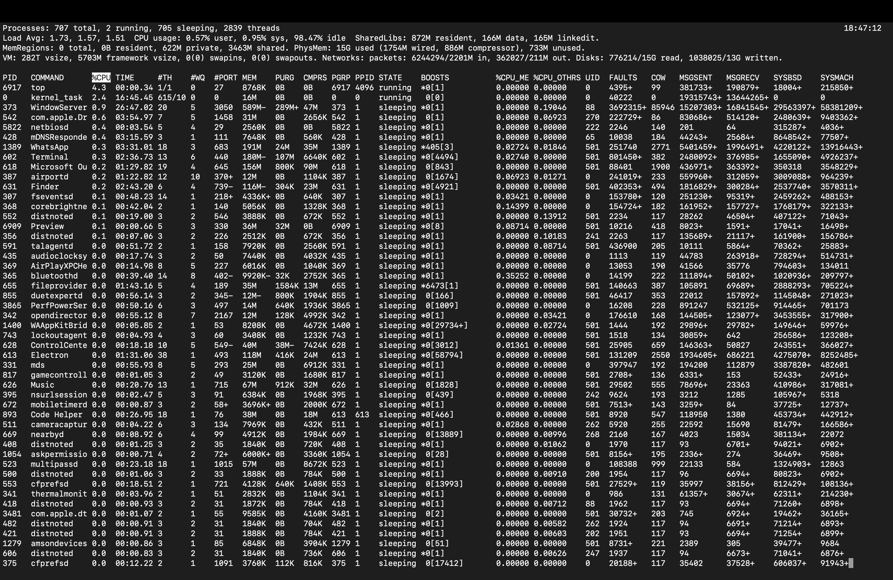

---
  
### **ps aux **   snapshot of all processes  

**OUTPUT : **
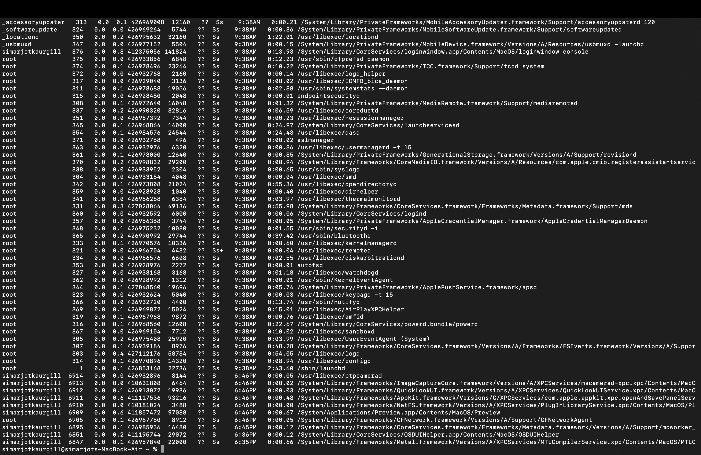

---

### **uptime**  system load averages  

**OUTPUT :**
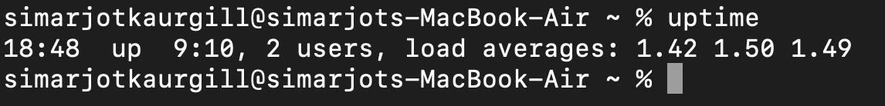

---

> *Note: `htop`, `free`, and `journalctl` are Linux-only. On macOS, `htop` can be installed via Homebrew if needed.*  

---

## Process Communication  
- `|` (pipe) → pass output of one command to another  

**OUTPUT :**
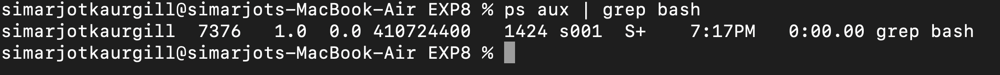


---

## Process Synchronization  
- `wait` → pause until background jobs finish  
- `wait <PID>` → wait for a specific process  

---

## Background Processes & Job Control  
- `&` → run in background  
- `jobs` → show background jobs  
- `fg %1` → bring job 1 to foreground  
- `bg %1` → resume job 1 in background  

---

## System Monitoring & Logging  


### **dmesg | less** :system/kernel messages (Linux; on macOS use `log show`)  

---

### **last** :show previously logged-in users  

**OUTPUT :**


---

### **`who` or `w`:**  show current users

**OUTPUT :**
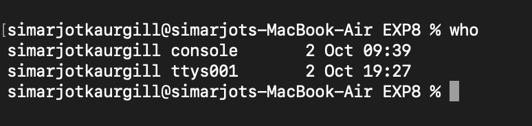

---

# LAB EXERCISES

### **TASK 1 - Check File Permissions**

**SCRIPT (labex1.sh):**
```bash
#!/bin/bash
echo "Enter filename: "
read file 

if [ -e "$file" ];
then
  [ -r "$file" ] && echo "file is readable."
  [ -w "$file" ] && echo "file is writable."
  [ -x "$file" ] && echo "file is executable."
else
  echo "file does not exist."
fi
./labex1.sh
```

**OUTPUT :**
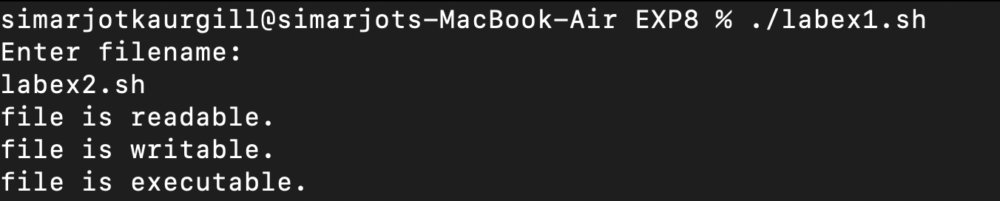

---


### **TASK 2 - STRING OPERATIONS**

**SCRIPT (labex2.sh):**
```bash
#!/bin/bash
echo "Enter first string : "
read str1
echo "Enter second string : "
read str2

# String length
echo "Length of first string: ${#str1}"
echo "Length of second string: ${#str2}"

#Concatenation
concat="$str1$str2"
echo "Concatenated string: $concat"

#Comparison
if [ "$str1" = "$str2" ];
then 
echo "Strings are equal."
else 
echo "Strings are not equal."
fi

./labex2.sh
```

**OUTPUT :**
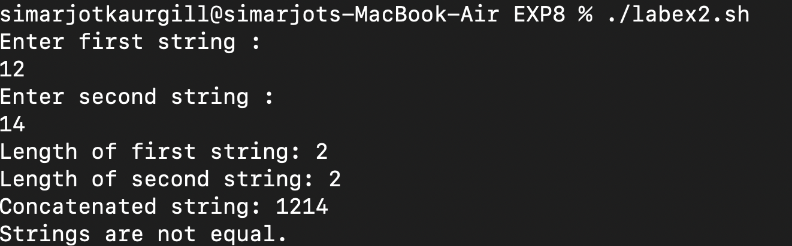

---

### **TASK 3 - Search for a pattern in a File**

**SCRIPT (labex3.sh)**
```bash
#!/bin/bash
echo "Enter filename."
read file
echo "Enter pattern to search: "
read pattern

if [ -e "$file" ];
then
echo "Matching lines: "
grep "$pattern" "$file"
else
echo "file not found."
fi
./labex3.sh
```

**OUTPUT:**
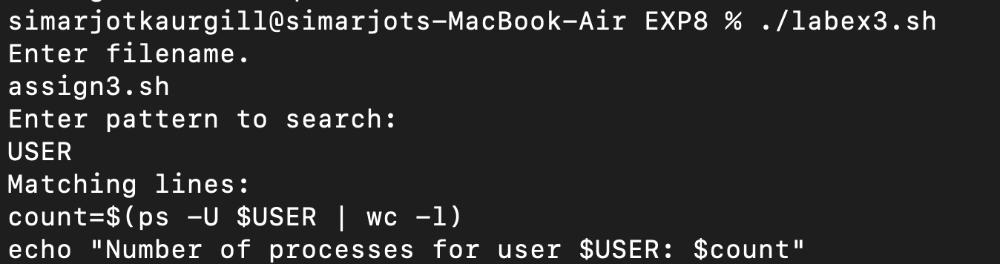

---

### **TASK 4 - display System Settings**

**SCRIPT (labex4.sh):**
```bash
#!/bin/bash
echo "System information: "
echo "___________________"
echo "Date and Time : $(date)"
echo "Logged in users: $9who)"
echo "System uptime : $(uptime -p)"
echo "Memory usage: "
free -h
echo "Disk usage: "
df -h

./labex4.sh
```

**OUTPUT :**
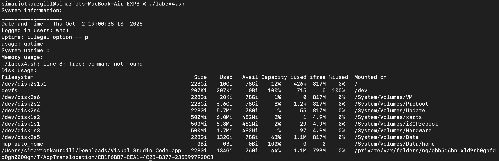

---

## **Observations**

kill command successfully sent signals to processes (SIGTERM, SIGKILL, etc.).

Process monitoring tools like top, ps aux, and uptime displayed correct system and resource usage information.

Pipes (|) worked correctly to pass the output of one command as input to another.

wait command synchronized background processes, ensuring scripts waited before continuing.

Job control commands (&, jobs, fg, bg) allowed running and managing background tasks.

System monitoring commands (dmesg, journalctl, last, who) displayed logs, kernel messages, and user activity successfully.

Lab exercise scripts (file permissions, string operations, pattern search, system info) executed as expected with correct results.


---

## **Conclusion**

This experiment helped in understanding process control, monitoring, and job management in shell scripting.

Learned how to manage processes using signals, background execution, and job control.

Understood how to monitor system resources and logs using commands.

Implemented process communication using pipes and synchronization with wait.

The lab exercises improved practical knowledge of working with processes and automating system tasks in Linux/macOS.


---


# **ASSIGNMENT**


### **Task 1**
Write a script that starts background job (eg sleep 60),lists all jobs,brings the
 job to the foreground and terminates it.

**SCRIPT (assign1.sh):**
```bash
#!/bin/bash
# Script: background_job.sh

echo "Starting a background job (sleep 60)..."
sleep 60 & 
job_id=$!

echo "Listing jobs:"
jobs

echo "Bringing job $job_id to foreground..."
fg %1

echo "Terminating job..."
kill -9 $job_id 2>/dev/null

echo "Job terminated."

./assign1.sh
```

**OUTPUT :**
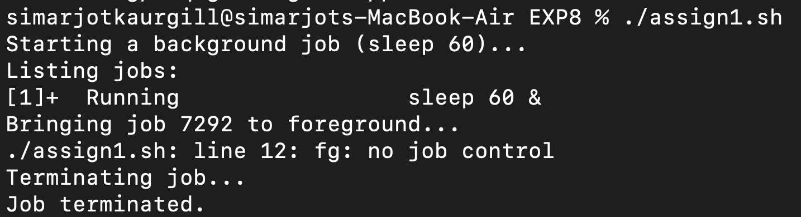

---

### **TASK 2 **

Create a script that compares two files and displays whether their contents are identical 
or different.

**SCRIPT (assign2.sh) :**
```bash
#!/bin/bash

echo -n "Enter first filename: "
read file1
echo -n "Enter second filename: "
read file2

if [ ! -f "$file1" ] || [ ! -f "$file2" ]; then
    echo "One or both files do not exist!"
    exit 1
fi

if cmp -s "$file1" "$file2"; then
    echo "Files are identical."
else
    echo "Files are different."
fi

./assign2.sh
```

**OUTPUT :**
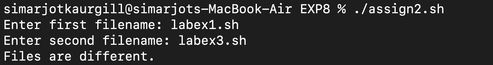

---

### **TASK 3**

Write a script that counts the number of processes currently being run by your user.

**SCRIPT (assign3.sh) :**
```bash 
#!/bin/bash

count=$(ps -U $USER | wc -l)
echo "Number of processes for user $USER: $count"

./assign3.sh
```

**OUTPUT :**


---

### **TASK 4**

Develop ascript that monitors memory usage every 5 seconds and logs it into a
new file.

**SCRIPT (assign4.sh) :**
```bash
#!/bin/bash
logfile="memory_log.txt"
echo "logging memory usage to $logfile ... press Ctrl+C to stop."

while true
do
echo "______ $(date) ______" >> "$logfile"
 top -l 1 | grep PhysMem >> "$logfile"
echo "______________________" >> "$logfile"
   sleep 5
done
./assign4.sh
```

**OUTPUT :**
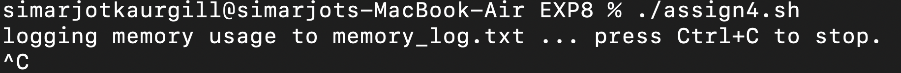

---

### **TASK 5 **

Write a script that prompts for a filename and a search pattern,then displays 
the count of matching lines.

**SCRIPT (assign5.sh) :**
```bash
#!/bin/bash
read -p "Enter filename: " file
read -p "Enter search pattern: " pattern

if [[ -f "$file" ]]; then
  count=$(grep -c "$pattern" "$file")
  echo "Found $count matching lines."
else
  echo "File not found."
fi
./assign5.sh
```

**OUTPUT :**
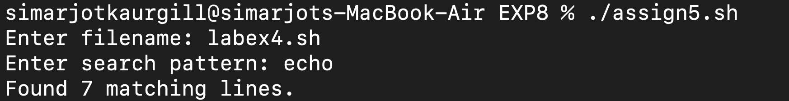

---
