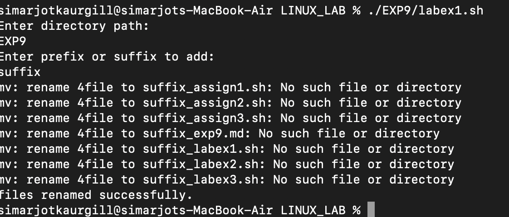
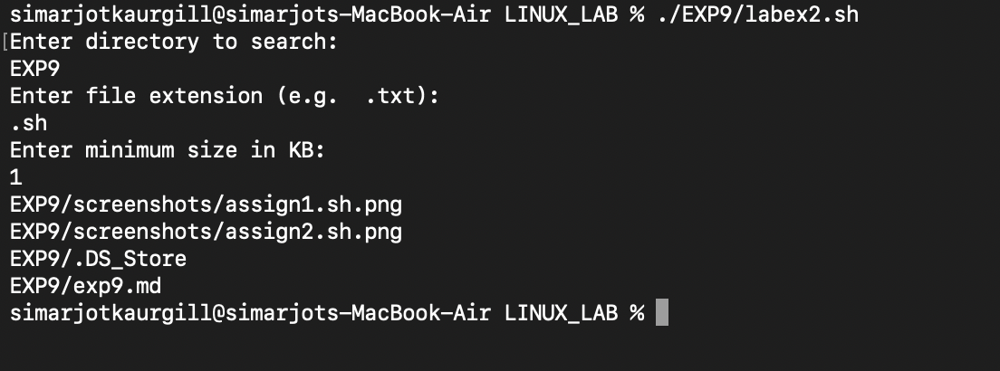
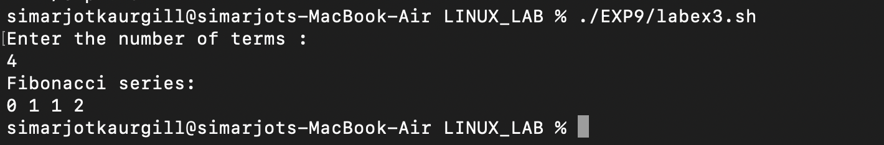
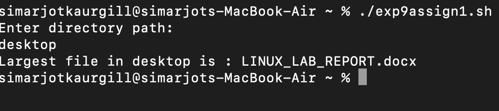
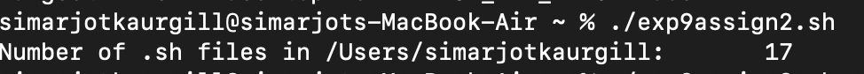

# EXPERIMENT 9 - SHELL PROGRAMMING 

## AIM
To write and exeute shell scripts for file manangement, sytem monitoring, and sequence generation in Linux.

---

## Tools & Software Used
- **Operating System:** macOS
- **Terminal Emulator:** macOS Terminal 
- **Shell:** Bash

---

##Theory 

Shell script automates repititive tasks and simplifies system administration.

1. File Handling : 
   Using shell scripts to rename files,search files based on extension/size, and manipulate directories.
 
2. System Performance Monitoring :
   Commands like top,df -h, and uptime help in analyzing CPU,memory, load average and disk usage.
   
3. User and Permission Manangement :
   Scripts may use :
```bash
chmod  # change file permissions
chown  # Change ownership
groups # View user groups

```
4.  Sequence generation (Fibnacci series):
    Used to understand loops and arithmetic operations in Bash.
    
# LAB EXERCISES 

### **TASK 1 - Rename all files in a directory**

**SCRIPT (labex1.sh):**
```bash
#!/bin/bash
echo "Enter directory path: "
read dir
echo "Enter prefix or suffix to add: "
read add

cd "$dir" || { echo "directory not found!"; exit 1; }

for file in *; do
     if [ -f "$file" ]; then
     mv "4file" "${add}_$file"
   fi
done
echo "files renamed successfully."
```

**OUTPUT :**


---

### **TASK 2 - Search files by extension or size**

**SCRIPT (labex2.sh):**
```bash
#!/bin/bash
echo "Enter directory to search: "
read dir
echo "Enter file extension (e.g.  .txt):"
read ext
echo "Enter minimum size in KB:"
read size

find "$dir" -type f -name "*$text" -size +"${size}k"

```

**OUTPUT :**


---

### **TASK 3 - Fibonacci Series

**SCRIPT (labex3.sh):**
```bash
#!/bin/bash
echo "Enter the number of terms : "
read n

a=0
b=1
echo "Fibonacci series: "
for ((i=0; i<n; i++))
do
    echo -n "$a "
    fn=$((a + b))
    a=$b
    b=$fn
done
echo

```

**OUTPUT :**


---

## **CONCLUSION**

In this experiment, we successfully learned and practiced shell scripting for :
file renaming, searching files based on conditions, generating fibonacci series, basic system monitoring , understanding loops, conditions and command usage.
Shell scripting improves efficiency and automates common Linux administrative tasks.

---

# **ASSIGNMENT**

### **Task 1**
Write a script to find the largest file in a given directory.

**SCRIPT (assign1.sh):**
```bash
#!/bin/bash
#Script to find the largest file in a given directory
echo "Enter directory path: "
read dir

if [ -d "$dir" ]; then
  largest_file=$(ls -S "$dir" 2>/dev/null | head -n 1)
  echo "Largest file in $dir is : $largest_file"
else
  echo "Directory not found."
fi
```

**OUTPUT :**


---

### **TASK 2**
Create a script that counts how many .sh files exist in /home/user.

```bash
#!/bin/bash

dir="$HOME"

if [ -d "$dir" ]; then
  count=$(ls "$dir"/*.sh 2>/dev/null | wc -l)
 echo "Number of .sh files in $dir: $count"
else
  echo "Directory $dir not found."
fi
 
```
**OUTPUT :**


---

### **TASK 3**
Create a script that adds a new user and sets default permissions for their home directory.

```bash
#!/bin/bash

echo "enter username to add: "
read username

sudo adduser "$username"
sudo chmod 700 /home/4username
echo "User $username added successfully with secure home directory."

```

---

